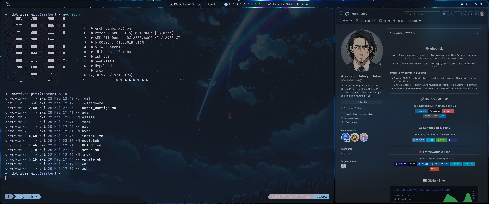

# Dotfiles

My personal dotfiles repository for a customized Hyprland-based desktop environment. This configuration builds upon the excellent [end-4/dots-hyprland](https://end-4.github.io/dots-hyprland-wiki/en/) foundation with custom modifications to the sidebar, top bar, and color generation setup.




## Components

This setup includes configurations for:

- **Hyprland** - Tiling Wayland compositor/window manager
- **AGS** (Aylur's GTK Shell) - JavaScript-based desktop environment with custom widgets
- **Pywal** - Color scheme generator based on wallpapers
- **Foot** - Fast, lightweight terminal emulator
- **Tmux** - Terminal multiplexer
- **Neofetch** - System information tool
- **Git** - Version control configuration
- **Zsh** - Shell configuration

## Features

My customized setup includes:

- **Auto-generated colorschemes** - Wallpaper-based theming with extended application support
- **OpenRouter-powered AI Assistant** - Custom sidebar with OpenRouter integration supporting multiple AI models
- **Redesigned top bar** - Custom appearance with similar functionality to the original
- **Enhanced sidebar** - Streamlined interface with focused functionality
- **Consistent theming** - Unified appearance across applications

## Installation Note

This repository is my personal configuration and is not designed for direct installation on other systems. If you're interested in a similar setup:

1. Install the original [end-4/dots-hyprland](https://end-4.github.io/dots-hyprland-wiki/en/) using their installation script
2. Once you have a working setup, you can adapt specific elements from this repository to customize your configuration

## Dependencies

This setup requires the following packages:

```bash
# Core components
hyprland hyprpaper hypridle hyprlock

# Desktop environment
aylurs-gtk-shell

# Appearance and colors
pywal imagemagick

# Utilities
foot tmux git zsh
```

## Directory Structure

- `hypr/` - Hyprland window manager configuration
  - `.config/hypr/hyprland/` - Default configurations
  - `.config/hypr/custom/` - Personalized configurations and overrides
- `ags/` - AGS (Aylur's GTK Shell) configuration
  - `.config/ags/modules/` - UI components (bar, sidebar, widgets)
  - `.config/ags/services/` - Background services
- `wal/` - Pywal configuration and templates
- `tmux/` - Tmux configuration
- `foot/` - Foot terminal configuration
- `git/` - Git configuration
- `zsh/` - Zsh shell configuration
- `neofetch/` - System information display configuration

## Customization

### Hyprland

Custom settings for Hyprland are maintained in the `hypr/.config/hypr/custom/` directory to make it easier to update the base configuration. Key files:

- `general.conf` - General Hyprland settings
- `keybinds.conf` - Custom keyboard shortcuts
- `rules.conf` - Window rules for specific applications
- `execs.conf` - Startup applications and services

### AGS

The AGS configuration is organized in a modular fashion:

- `user_options.jsonc` - User-specific preferences
- `modules/` - UI components organized by function
- `services/` - Background services for system monitoring and control

## Credits

This configuration builds upon [end-4/dots-hyprland](https://end-4.github.io/dots-hyprland-wiki/en/), which provided the foundation for this setup. I've made custom modifications to the sidebar, top bar, and expanded the color generation setup to include additional applications.

## Management

### Updating

After making changes to your configuration files, they're automatically reflected in your system since they're symlinked.

To update the repository after making changes:

```bash
./update.sh --all   # Update all configurations
./update.sh hypr    # Update just the Hypr configuration
```

### Removing

To remove symlinks created by stow:

```bash
stow -D -t ~ foot git  # For stow-managed configs
```

For configurations managed by the adopt script:

```bash
rm ~/.config/hypr
mv ~/.config/hypr.bak ~/.config/hypr  # Restore from backup
```

## Notes

- The adoption script creates backups of your original configurations with `.bak` extension
- Configuration files are organized to separate base settings from personal customizations
- Custom settings override the default ones, making it easier to update the base configuration 